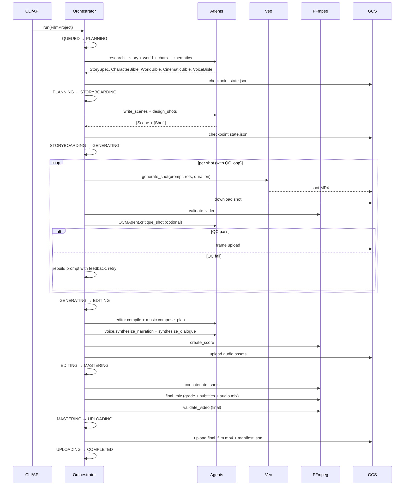
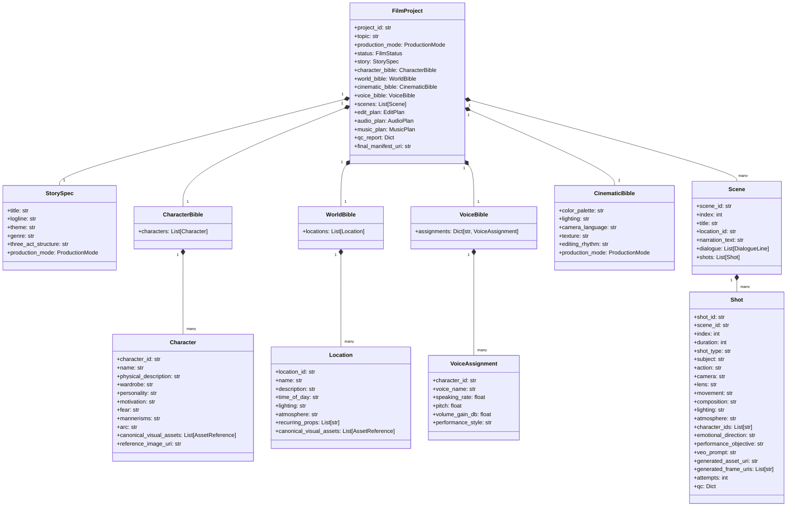
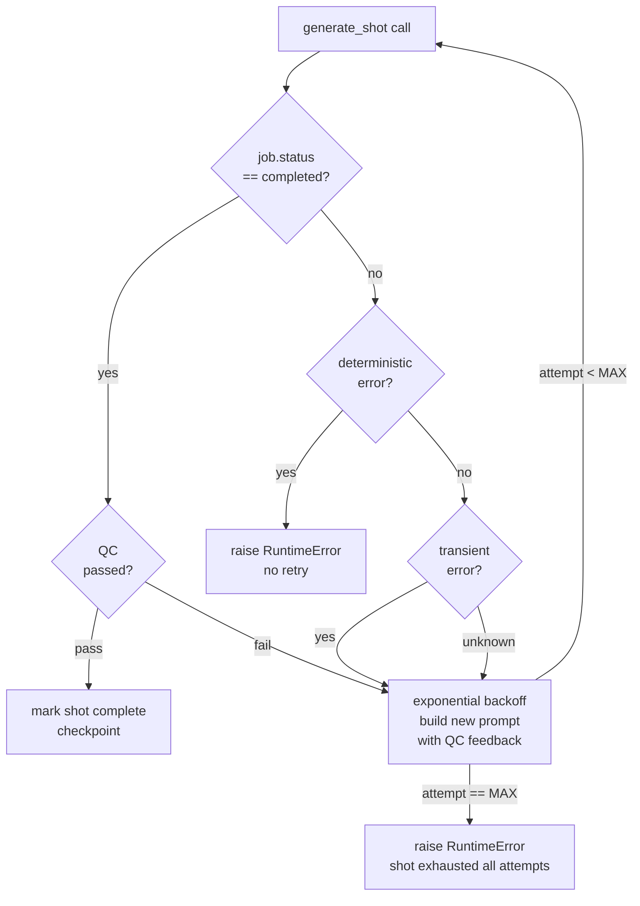
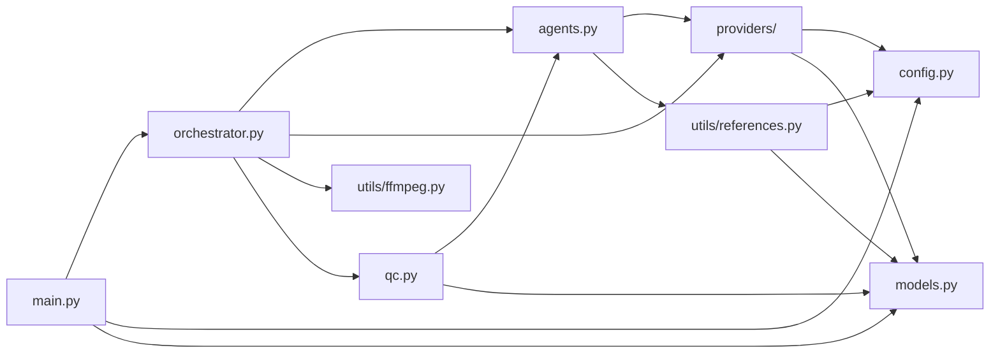

# Design Document: VidGen Cinematic Engine

## Overview

This document describes the complete architectural upgrade of the VidGen repository into a production-grade cinematic generation engine. The system treats every generated shot as part of one continuous film rather than an independent generation, enforcing story continuity, character identity, world consistency, and coherent cinematography from first frame to final MP4.

The design is grounded entirely in the verified capabilities of the existing repository: `google-genai` SDK with Vertex AI, `veo-3.1-generate-001`, `gemini-2.5-flash`, `gemini-2.5-flash-image`, Google Cloud TTS, GCS, FFmpeg, and the established Pydantic model layer. No hallucinated APIs, model names, or capabilities are introduced.

The engine supports two first-class production modes: `SHORT_FILM` and `PREMIUM_AUTOMOTIVE_AD`, differentiated at the story/cinematic-bible layer with mode-specific prompt grammar and QC criteria.

---

## Part 1: High-Level Design

### 1.1 System Architecture

The system is organised as a layered pipeline where each layer has a single responsibility and communicates only through the shared `FilmProject` state object, persisted to GCS at every stage boundary.

```mermaid
graph TD
    subgraph API Layer
        API[FastAPI: main.py]
        CLI[CLI: run_production.py]
    end

    subgraph Orchestration Layer
        ORC[Orchestrator]
        CP[Checkpoint Manager]
    end

    subgraph Production Bibles
        SB[Story Bible\nStorySpec + ProductionMode]
        CB[Character Bible\nCharacter + canonical assets]
        WB[World / Location Bible\nLocation + canonical assets]
        CINB[Cinematic Bible\ncolor / lighting / camera / texture]
        VB[Voice Bible\ncharacter_id → TTS voice params]
        SHP[Shot Plan\nScene + Shot list with formal specs]
    end

    subgraph Agent Layer
        RA[ResearchAgent]
        SAA[StoryArchitectAgent]
        CDA[CharacterDesignAgent]
        WDA[WorldDesignAgent]
        CINA[CinematographerAgent]
        SWA[ScreenwriterAgent]
        SBA[StoryboardAgent]
        VA[VoiceAgent]
        MA[MusicAgent]
        EA[EditorAgent]
        SUBA[SubtitleAgent]
        QCMA[QCMAgent]
    end

    subgraph Provider Layer
        VID[VideoGenerator\nVeoVideoGenerator / MockVideoGenerator]
        IMG[GeminiImageGenerator]
        TTS[Cloud TTS]
        STG[StorageProvider\nCloudStorageProvider / MockStorageProvider]
    end

    subgraph Post-Production Layer
        FFM[FFmpeg Utilities\nconcatenate / normalize / mix / grade]
        CAPS[capability_check.py\npre-flight validation]
    end

    subgraph State Layer
        GCS[(GCS State\nprojects/pid/state.json\nreferences/\nshots/\ndeliverables/)]
        LOCAL[/tmp/vidgen/pid/\nlocal working directory]
    end

    API -->|creates FilmProject| ORC
    CLI -->|loads / resumes FilmProject| ORC
    ORC --> CP
    CP --> GCS
    ORC --> RA --> SB
    ORC --> SAA --> SB
    ORC --> CDA --> CB
    ORC --> WDA --> WB
    ORC --> CINA --> CINB
    ORC --> SWA --> SHP
    ORC --> SBA --> SHP
    ORC --> VID
    ORC --> VA
    ORC --> MA
    ORC --> EA
    ORC --> SUBA
    ORC --> QCMA
    CDA --> IMG
    WDA --> IMG
    VID --> STG
    IMG --> STG
    VA --> TTS
    ORC --> FFM
    STG --> GCS
    ORC --> LOCAL
```

### 1.2 Production Mode Architecture

```mermaid
graph LR
    REQ[FilmCreateRequest\nproduction_mode: SHORT_FILM | PREMIUM_AUTOMOTIVE_AD]
    MDISP[Mode Dispatcher\nin Orchestrator._plan_mode]
    SF[SHORT_FILM path\nPsychological Drama defaults\nNolan / Cameron inspiration\nCillian / Bale / Hardy performance quality]
    AA[PREMIUM_AUTOMOTIVE_AD path\nCinematic product cinematography\nVehicle identity consistency\nMaterials / physics / reflections\nPremium commercial pacing]

    REQ --> MDISP
    MDISP --> SF
    MDISP --> AA
```

Both modes share the same pipeline stages. The mode affects:
- Default genre, tone, and cinematic-bible parameters injected by `CinematographerAgent`
- Storyboard shot grammar (`StoryboardAgent` system prompt variant)
- Voice performance style in `VoiceAgent`
- QC acceptance thresholds in `QCMAgent`

### 1.3 Pipeline Stage Sequence



### 1.4 GCS Asset Hierarchy

```
gs://{GCS_BUCKET}/
├── fingerprints/
│   └── {sha256}.json                       # idempotency mapping
└── projects/{project_id}/
    ├── state.json                           # FilmProject checkpoint (full JSON)
    ├── research.md
    ├── references/
    │   ├── character_{character_id}.png     # canonical headshot
    │   └── location_{location_id}.png       # canonical location still
    ├── shots/
    │   └── {shot_id}/
    │       ├── {uuid}.mp4                   # Veo output
    │       └── frame_0.png                  # mid-shot frame for QC / continuity
    ├── audio/
    │   ├── narration.mp3
    │   ├── music.m4a
    │   └── dialogue_{n}.mp3
    ├── subtitles.srt
    └── deliverables/
        ├── final_film.mp4
        └── manifest.json
```

### 1.5 Data Model Hierarchy



### 1.6 Error Handling and Fault Tolerance



Deterministic errors (404, 403, 400, invalid_argument, permission denied) are never retried. Transient errors (429, 5xx, timeout) are retried with exponential backoff. All unknown errors are treated as transient for one retry cycle.

### 1.7 Dependency Map



---

## Part 2: Low-Level Design

### 2.1 New Model: `ProductionMode` and `VoiceBible`

The existing `models.py` requires two additions: a `ProductionMode` enum and a `VoiceBible` model. Both are additive and do not break existing model serialisation.

```python
class ProductionMode(str, Enum):
    SHORT_FILM = "short_film"
    PREMIUM_AUTOMOTIVE_AD = "premium_automotive_ad"

class VoiceAssignment(BaseModel):
    character_id: str = ""
    voice_name: str = ""           # e.g. "en-US-Neural2-J"
    speaking_rate: float = 0.85
    pitch: float = -2.0
    volume_gain_db: float = 0.0
    performance_style: str = ""    # e.g. "gravitas", "terse", "urgent"

class VoiceBible(BaseModel):
    assignments: Dict[str, VoiceAssignment] = Field(default_factory=dict)
    narrator_voice: str = "en-US-Neural2-J"
    narrator_speaking_rate: float = 0.85
    narrator_pitch: float = -2.0
```

`FilmProject` gains one new field: `production_mode: ProductionMode = ProductionMode.SHORT_FILM` and `voice_bible: Optional[VoiceBible] = None`. `FilmCreateRequest` in `main.py` gains `production_mode: ProductionMode = ProductionMode.SHORT_FILM`.

### 2.2 `VoiceDesignAgent` — New Agent

A new agent derives the `VoiceBible` from the `CharacterBible`. It is called once during PLANNING, immediately after character design.

```python
class VoiceDesignAgent(BaseAgent):
    """
    Assigns a unique, character-appropriate TTS voice and performance parameters
    to each character in the CharacterBible.

    Preconditions:
        - p.character_bible is fully populated (characters have name, personality, arc)
        - len(p.character_bible.characters) >= 1

    Postconditions:
        - Returns VoiceBible with one VoiceAssignment per character
        - Each assignment uses a distinct voice_name from the Cloud TTS Neural2 / Studio pool
        - speaking_rate is in [0.75, 1.05]
        - pitch is in [-4.0, 2.0]

    Loop invariant (over characters):
        - voice_names are never duplicated across assignments
    """
    # Available Neural2 voices confirmed in Cloud TTS (no hallucination)
    _VOICE_POOL = [
        "en-US-Neural2-A", "en-US-Neural2-D", "en-US-Neural2-E",
        "en-US-Neural2-F", "en-US-Neural2-I", "en-US-Neural2-J",
        "en-GB-Neural2-B", "en-GB-Neural2-C", "en-GB-Neural2-D",
    ]

    def design_voices(self, p: FilmProject) -> VoiceBible:
        """
        Uses LLM to match character personality to voice parameters,
        then maps to a concrete voice from _VOICE_POOL.

        Returns VoiceBible with assignments keyed by character_id.
        """
        class VoiceSpec(BaseModel):
            character_id: str
            performance_style: str  # e.g. "gravitas", "terse", "fearful"
            speaking_rate: float    # 0.75 – 1.05
            pitch: float            # -4.0 – 2.0

        class Out(BaseModel):
            specs: List[VoiceSpec]

        chars = p.character_bible.characters
        r = self.llm(
            f"Characters: {[f'{c.character_id}={c.name}: {c.personality}' for c in chars]}\n"
            "Assign a unique vocal performance style to each character. "
            "speaking_rate in [0.75, 1.05]; pitch in [-4.0, 2.0].",
            "You are a voice director. Return JSON array 'specs'.",
            Out
        )
        assignments = {}
        used_voices = set()
        for i, spec in enumerate(r.specs):
            # Assign voice from pool without repetition
            pool = [v for v in self._VOICE_POOL if v not in used_voices]
            voice = pool[i % len(pool)] if pool else self._VOICE_POOL[i % len(self._VOICE_POOL)]
            used_voices.add(voice)
            assignments[spec.character_id] = VoiceAssignment(
                character_id=spec.character_id,
                voice_name=voice,
                speaking_rate=max(0.75, min(1.05, spec.speaking_rate)),
                pitch=max(-4.0, min(2.0, spec.pitch)),
                performance_style=spec.performance_style,
            )
        return VoiceBible(assignments=assignments)
```

### 2.3 `VoiceAgent` — Updated `synthesize_dialogue`

The existing `VoiceAgent` does round-robin voice assignment. It must be updated to consume `VoiceBible` when available, falling back to the existing round-robin only when the bible is absent (backward compat).

```python
def synthesize_dialogue(self, p: FilmProject, root: Path) -> List[tuple[str, dict]]:
    """
    Synthesises every dialogue line in the project using the VoiceBible assignment
    for that character. Falls back to round-robin Neural2 if no VoiceBible.

    Preconditions:
        - p.scenes are sorted by index and fully populated with shots
        - root is a writable directory
        - Cloud TTS client is authenticated

    Postconditions:
        - Returns list of (local_path, timeline_dict) in chronological order
        - Each mp3 file exists at the returned local path
        - timeline start times are non-negative and monotonically non-decreasing

    Loop invariants:
        - cursor (accumulated scene time) is non-negative and non-decreasing
        - Each dialogue line's start time >= cursor
    """
    ...
```

### 2.4 `StoryArchitectAgent` — Mode-Aware Design

The existing `design_story` method is extended with a `production_mode` parameter that injects mode-specific constraints into the LLM system prompt.

```python
def design_story(self, topic: str, research: str,
                 production_mode: ProductionMode = ProductionMode.SHORT_FILM) -> StorySpec:
    """
    Preconditions:
        - topic is non-empty
        - production_mode is a valid ProductionMode enum value

    Postconditions:
        - Returns StorySpec with all fields non-empty
        - If SHORT_FILM: genre reflects psychological drama / character study
        - If PREMIUM_AUTOMOTIVE_AD: genre reflects premium commercial / brand narrative
        - title is evocative and non-literal
        - logline is ≤ 2 sentences

    No side effects on input parameters.
    """
    mode_context = {
        ProductionMode.SHORT_FILM: (
            "This is a SHORT FILM for international festival submission. "
            "Cinematic inspiration: Christopher Nolan (temporal structure, moral weight), "
            "James Cameron (spectacle grounded in human stakes). "
            "Performance quality: Cillian Murphy (internality, restraint), "
            "Christian Bale (physical transformation, commitment), "
            "Tom Hardy (physicality, subtext). "
            "Generate ORIGINAL fictional characters. Do NOT reference or reproduce real people."
        ),
        ProductionMode.PREMIUM_AUTOMOTIVE_AD: (
            "This is a PREMIUM AUTOMOTIVE ADVERTISEMENT. "
            "The hero product is the vehicle. Human characters exist to contextualise the vehicle's identity. "
            "Tone: aspirational, cinematic, futuristic. Pacing: precise, commercial, punchy. "
            "Every shot must showcase vehicle materials, reflections, motion physics, or silhouette. "
            "No generic car-ad tropes. Aim for art-directed brand filmmaking."
        ),
    }[production_mode]
    ...
```

### 2.5 `CinematographerAgent` — Mode-Aware Cinematic Bible

```python
def design_cinematics(self, p: FilmProject) -> CinematicBible:
    """
    Preconditions:
        - p.story.title and p.story.theme are non-empty
        - p.production_mode is set

    Postconditions:
        - Returns CinematicBible with all five pillars non-empty
        - SHORT_FILM: camera_language forbids drone shots and generic coverage
        - PREMIUM_AUTOMOTIVE_AD: color_palette includes metallic/reflective language;
          camera_language specifies hero product framing rules

    No LLM call is made if cinematic_bible is already fully populated (idempotency).
    """
    ...
```

### 2.6 `build_veo_generation_package` — Automotive Mode Extension

The existing function in `agents.py` must detect `ProductionMode.PREMIUM_AUTOMOTIVE_AD` and inject vehicle-specific mandate blocks.

```python
def build_veo_generation_package(
    shot: Shot,
    p: FilmProject,
    feedback: str = "",
    previous_shot: Shot | None = None,
) -> dict:
    """
    Constructs a self-contained Veo generation package from the shot and all production bibles.

    Preconditions:
        - shot.shot_id and shot.action are non-empty
        - p.cinematic_bible is set
        - All reference assets in the package have URIs starting with 'gs://'

    Postconditions:
        - Returns dict with keys 'prompt' (str) and 'reference_assets' (List[dict])
        - prompt is non-empty
        - All reference_asset URIs start with 'gs://'
        - If production_mode == PREMIUM_AUTOMOTIVE_AD, prompt contains vehicle mandate block
        - If feedback is non-empty, prompt contains corrective feedback block before main content

    Loop invariants (over visible_chars):
        - Each character's canonical asset URI is a valid GCS URI if present
        - No duplicate asset URIs in reference_assets list

    No mutations to input parameters (shot, p, previous_shot).
    """
    mode = getattr(p, 'production_mode', ProductionMode.SHORT_FILM)
    if mode == ProductionMode.PREMIUM_AUTOMOTIVE_AD:
        # Inject vehicle identity mandate
        parts.append(
            "== AUTOMOTIVE MANDATE ==\n"
            "The hero subject is the vehicle. Render with studio-quality materials: "
            "paint clearcoat depth, panel reflection accuracy, tyre sidewall detail, "
            "interior ambient glow. Physics must be believable (no floating, no gravity errors). "
            "Camera angles must flatter the vehicle silhouette. "
            "Human subjects are supporting cast — never obscure the vehicle's hero angles.\n"
            "== END AUTOMOTIVE MANDATE =="
        )
    ...
```

### 2.7 `Orchestrator` — Mode Routing and `VoiceDesignAgent` Integration

```python
class Orchestrator:
    def __init__(self):
        ...
        self.voice_design = VoiceDesignAgent()  # NEW

    def run(self, p: FilmProject) -> None:
        """
        Main pipeline entry point. Resumable at any FilmStatus boundary.

        Preconditions:
            - p.project_id is non-empty
            - settings.is_production XOR MockVideoGenerator is active

        Postconditions:
            - On success: p.status == FilmStatus.COMPLETED
              and p.final_manifest_uri points to a real GCS URI
            - On failure: p.status == FilmStatus.FAILED
              and p.message contains the root cause
            - GCS checkpoint is written at every stage transition
            - No mock media is accepted in production mode
              (validate_video raises on stub bytes)

        Resumability invariant:
            - If run() is called again on a project with status S,
              it skips all stages before S and resumes from S.
        """
        ...
        if p.status == FilmStatus.QUEUED:
            ...
            # NEW: voice bible after character design
            if not p.voice_bible or not p.voice_bible.assignments:
                p.voice_bible = self.voice_design.design_voices(p)
            ...
```

### 2.8 `concatenate_shots` — Sequential Final Assembly

The existing implementation in `utils/ffmpeg.py` is correct for the core use case. The algorithm is documented formally here:

```
ALGORITHM concatenate_shots(shot_files, output_path, expected_durations)
INPUT:
    shot_files: List[str]        -- local paths to validated MP4 files
    output_path: str             -- destination MP4 path
    expected_durations: Optional[List[float]]  -- per-shot target duration in seconds

PRECONDITIONS:
    - len(shot_files) >= 1
    - All paths in shot_files exist on local disk
    - output_path parent directory is writable
    - If expected_durations is provided: len(expected_durations) == len(shot_files)

POSTCONDITIONS:
    - output_path exists and contains a valid H.264 MP4
    - duration(output) ≈ sum(expected_durations) ± 0.5s
    - output has exactly one video stream (H.264) and one audio stream (AAC)
    - No placeholder / stub bytes accepted (validate_video would raise)

LOOP INVARIANT (normalization loop):
    - For each processed shot i: normalized[i] is a valid 1920x1080 H.264 MP4
      with AAC audio at 48kHz, duration == expected_durations[i] ± tpad tolerance
    - All previously normalized shots remain valid

ALGORITHM:
BEGIN
    normalized ← []
    FOR i, path IN enumerate(shot_files) DO
        ASSERT path exists
        expected ← expected_durations[i] IF expected_durations ELSE None
        validate_video(path, expected)           -- raises on invalid
        target ← work_dir / f"normal_{i:03d}.mp4"
        normalize_video(path, target, expected)  -- tpad + scale + aac
        ASSERT target exists AND valid
        normalized.append(target)
    END FOR
    ASSERT len(normalized) == len(shot_files)
    
    -- Build FFmpeg filter_complex concat graph
    inputs ← flatten([["-i", p] for p in normalized])
    chains ← ["[{i}:v][{i}:a]" for i in range(len(normalized))]
    graph ← "".join(chains) + f"concat=n={len(normalized)}:v=1:a=1[v][a]"
    run_ffmpeg([*inputs, "-filter_complex", graph, "-map", "[v]", "-map", "[a]",
                "-c:v", "libx264", ..., output_path])
    ASSERT output_path exists
END
```

### 2.9 QC Agent Formal Specifications

```
ALGORITHM QCMAgent.critique_shot(frame_path, shot, cinematic_bible, ...)
INPUT:
    frame_path: str          -- local path to a PNG frame extracted from the shot
    shot: Shot               -- the shot metadata
    cinematic_bible: CinematicBible
    prev_frame_path: str?    -- frame from the preceding shot (None for shot 0)
    prev_shot: Shot?
    characters: List[Character]
    storage: StorageProvider

PRECONDITIONS:
    - frame_path exists and is a valid PNG (readable by Pillow/genai)
    - shot.shot_id is non-empty
    - cinematic_bible.color_palette is non-empty

POSTCONDITIONS:
    - Returns Dict with keys: "passed" (bool), "feedback" (List[str])
    - "passed" == True IFF artifact_free AND (no character_id mismatch) AND (no continuity break)
    - Style critique is advisory only (never sets passed=False alone)
    - No mutations to input parameters

ALGORITHM:
BEGIN
    critique ← {"passed": True, "feedback": []}
    
    artifact_report ← check_visual_artifacts(frame_path)
    IF NOT artifact_report.artifact_free THEN
        critique.passed ← False
        critique.feedback.append(artifact issues)
        RETURN critique          -- early exit: no point running further checks
    END IF
    
    style_report ← check_cinematic_style(frame_path, shot, cinematic_bible)
    IF NOT style_report.style_adherent THEN
        critique.feedback.append(style note)   -- advisory, does not fail
    END IF
    
    IF shot.character_ids is non-empty THEN
        char ← first character in shot.character_ids
        ref_path ← resolve_reference_path(char, storage)
        IF ref_path is non-empty THEN
            char_report ← check_character_consistency(ref_path, frame_path)
            IF NOT char_report.consistent THEN
                critique.passed ← False
                critique.feedback.append(character inconsistency)
            END IF
        END IF
    END IF
    
    IF prev_frame_path is non-empty AND prev_shot is not None THEN
        cont_report ← check_continuity(prev_frame_path, frame_path, prev_shot, shot, characters)
        IF NOT cont_report.continuity_ok THEN
            critique.passed ← False
            critique.feedback.append(continuity errors)
        END IF
    END IF
    
    RETURN critique
END
```

### 2.10 Key Function Signatures

```python
# models.py — additions
class ProductionMode(str, Enum): ...
class VoiceAssignment(BaseModel): ...
class VoiceBible(BaseModel): ...
# FilmProject gains: production_mode, voice_bible

# agents.py — additions / modifications
class VoiceDesignAgent(BaseAgent):
    def design_voices(self, p: FilmProject) -> VoiceBible: ...

class StoryArchitectAgent(BaseAgent):
    def design_story(self, topic: str, research: str,
                     production_mode: ProductionMode) -> StorySpec: ...

class CinematographerAgent(BaseAgent):
    def design_cinematics(self, p: FilmProject) -> CinematicBible: ...

class VoiceAgent:
    def synthesize_narration(self, text: str, output_path: str) -> None: ...
    def synthesize_dialogue(self, p: FilmProject, root: Path) -> List[tuple[str, dict]]: ...
    # synthesize() is kept as a backward-compat alias for synthesize_narration

def build_veo_generation_package(
    shot: Shot,
    p: FilmProject,
    feedback: str = "",
    previous_shot: Shot | None = None,
) -> dict: ...

# orchestrator.py — additions
class Orchestrator:
    voice_design: VoiceDesignAgent  # new field
    def run(self, p: FilmProject) -> None: ...
    def checkpoint(self, p: FilmProject) -> None: ...
    def _set(self, p, status, msg, pct) -> None: ...
    def _get_previous_shot(self, p: FilmProject, current_shot_index: int) -> Shot | None: ...
    def _generate_and_critique_shot(self, p: FilmProject, shot: Shot,
                                     root: Path, prev_shot: Shot | None) -> None: ...
    def _build_audio(self, p: FilmProject, root: Path) -> None: ...
    def _download_edit_assets(self, p: FilmProject, root: Path) -> tuple: ...

# main.py — additions
class FilmCreateRequest(BaseModel):
    ...
    production_mode: ProductionMode = ProductionMode.SHORT_FILM

# utils/ffmpeg.py — no new functions; existing implementations are correct
# validate_video, normalize_video, concatenate_shots, create_score, final_mix, extract_frames

# capability_check.py — no changes required; check_veo, check_gemini, check_image are correct
```

### 2.11 Example Usage

```python
# Create a SHORT_FILM project via API
import requests
resp = requests.post("http://localhost:8080/api/v1/films", json={
    "topic": "A lighthouse keeper who discovers the light has been attracting something other than ships",
    "duration_seconds": 48,
    "genre": "psychological horror",
    "language": "English",
    "aspect_ratio": "16:9",
    "production_mode": "short_film",
})
project_id = resp.json()["project_id"]

# Poll status
import time
while True:
    s = requests.get(f"http://localhost:8080/api/v1/films/{project_id}").json()
    print(s["status"], s["progress"])
    if s["status"] in ("completed", "failed"):
        break
    time.sleep(10)

# Download final MP4
video = requests.get(f"http://localhost:8080/download/{project_id}")
open("film.mp4", "wb").write(video.content)
```

```python
# Create a PREMIUM_AUTOMOTIVE_AD project directly via Orchestrator
from vidgen.models import FilmProject, ProductionMode
from vidgen.orchestrator import Orchestrator

p = FilmProject(
    topic="The APEX-X1: a near-future electric hypercar that exists at the intersection "
          "of sculpture and engineering — its first appearance on a fog-covered mountain road at dawn.",
    production_mode=ProductionMode.PREMIUM_AUTOMOTIVE_AD,
    duration_seconds=60,
    genre="premium automotive advertisement",
    language="English",
    aspect_ratio="16:9",
)

orc = Orchestrator()
orc.run(p)
# p.final_manifest_uri now points to gs://{bucket}/projects/{pid}/deliverables/final_film.mp4
```

### 2.12 Correctness Properties

The following properties must hold at all times and are validated by the test suite:

1. **Production guard**: `settings.is_production == False` implies `get_video_generator()` returns `MockVideoGenerator` and `get_storage_provider()` returns `MockStorageProvider`. No real Veo or GCS calls are ever made in simulation mode.

2. **Idempotency**: Calling `Orchestrator.run(p)` on a project with `status == COMPLETED` makes no GCS writes and returns immediately without re-generating any assets.

3. **Resumability**: For any project at status S ∈ {PLANNING, STORYBOARDING, GENERATING, EDITING, MASTERING, UPLOADING}, calling `run(p)` again skips all stages before S and resumes correctly from S.

4. **No silent mock in production**: In production mode (`FILM_MODE=production AND ALLOW_REAL_GENERATION=true`), `MockVideoGenerator` is never instantiated and `MockStorageProvider` is never instantiated.

5. **GCS URI exclusivity for reference assets**: Every entry in `reference_assets` passed to `VeoVideoGenerator.generate_shot` must satisfy `uri.startswith("gs://")`. Non-GCS URIs raise `ValueError` before the API call.

6. **Shot QC gate**: `shot.generated_asset_uri` is set if and only if `validate_video` returned `{"valid": True}` for that shot's local MP4. Shots with `generated_asset_uri == ""` are never included in `edit_plan.sequence`.

7. **Final MP4 validity**: The file at `final_film.mp4` must pass `validate_video` (H.264/HEVC/VP9/AV1, ≥ 640x360, has_audio, duration > 0.5s) before being uploaded.

8. **VoiceBible uniqueness**: All `voice_name` values in `VoiceBible.assignments` are distinct (no two characters share the same TTS voice).

9. **Character reference integrity**: For each `Character` with a non-empty `reference_image_uri`, that URI starts with `gs://` and was successfully uploaded to GCS before the first shot featuring that character is generated.

10. **Automotive mandate injection**: For any `FilmProject` with `production_mode == PREMIUM_AUTOMOTIVE_AD`, every Veo prompt generated by `build_veo_generation_package` contains the string `"AUTOMOTIVE MANDATE"`.

---

## Part 3: Testing Strategy

### Unit Testing

All existing tests in `tests/` continue to pass unchanged. New unit tests are added in the same files or new `test_production_mode.py` and `test_voice_bible.py` files.

Key unit test coverage:
- `VoiceDesignAgent.design_voices` returns a `VoiceBible` with unique voice names
- `StoryArchitectAgent.design_story` with `ProductionMode.PREMIUM_AUTOMOTIVE_AD` injects the correct mode context
- `build_veo_generation_package` with automotive mode contains `"AUTOMOTIVE MANDATE"` in the prompt
- `ProductionMode` enum serialises/deserialises correctly from JSON (Pydantic round-trip)

### Property-Based Testing

Library: `pytest` with `unittest.mock`. No new testing framework is introduced.

Key properties:
- For any `VoiceBible` returned by `VoiceDesignAgent`, all `voice_name` values are distinct
- For any `FilmProject` serialised to JSON and deserialised, all fields are preserved
- `concatenate_shots` with an empty list raises `RuntimeError("No validated shots to edit")`

### Integration Testing (Simulation Mode)

The existing `test_simulation.py` tests remain the primary integration gate. The simulation test is extended to verify:
- `VoiceDesignAgent.design_voices` is called during planning
- `p.voice_bible` is set after planning completes
- `ProductionMode.PREMIUM_AUTOMOTIVE_AD` projects reach `COMPLETED` in simulation

### End-to-End Production Validation

Run `run_production.py` with `FILM_MODE=production ALLOW_REAL_GENERATION=true` and a valid GCP project. The quality gate at the end of `run_production.py` is the authoritative production acceptance check.

---

## Part 4: Security Considerations

- Production mode requires two independent env vars (`FILM_MODE=production` AND `ALLOW_REAL_GENERATION=true`) to prevent accidental expensive generations
- GCS credentials are handled entirely by Application Default Credentials; no keys are stored in code or config files
- All `FilmCreateRequest` inputs are validated by Pydantic before any processing begins
- `VIDGEN_PROJECT_ID` is required in production worker mode to prevent accidental re-runs against wrong projects

---

## Part 5: Performance Considerations

- Reference image generation is idempotent: GCS existence check prevents re-generation across runs
- Shot normalization runs in a `ThreadPoolExecutor(max_workers=4)` for parallel processing
- Veo polling uses exponential backoff (5s → 30s max) to avoid hammering the operations endpoint
- `SHOTS_PER_SCENE` and `MAX_SHOTS` are configurable caps that prevent runaway generation costs
- `IMAGE_REQUEST_DELAY_SECONDS` (default 3.0s) throttles image generation to avoid quota exhaustion

---

## Part 6: Dependencies

All dependencies are already present in `requirements.txt`. No new packages are required:

| Package | Version | Use |
|---|---|---|
| `fastapi` | 0.141.1 | HTTP API layer |
| `uvicorn` | 0.52.1 | ASGI server |
| `google-genai` | >=2.0.0 | Gemini / Veo / Imagen via Vertex AI |
| `google-cloud-aiplatform` | 1.163.0 | Vertex AI auth |
| `google-cloud-storage` | 3.13.1 | GCS read/write/exists |
| `google-cloud-texttospeech` | 2.37.0 | TTS narration + dialogue |
| `moviepy` | 2.2.1 | (available, not used in hot path) |
| `Pillow` | 11.3.0 | Image byte handling |
| `python-dotenv` | 1.2.2 | `.env` loading |
| `pytest` | 8.3.2 | Test runner |
| `ffmpeg` (system binary) | any recent | Video encode/decode/mix |
